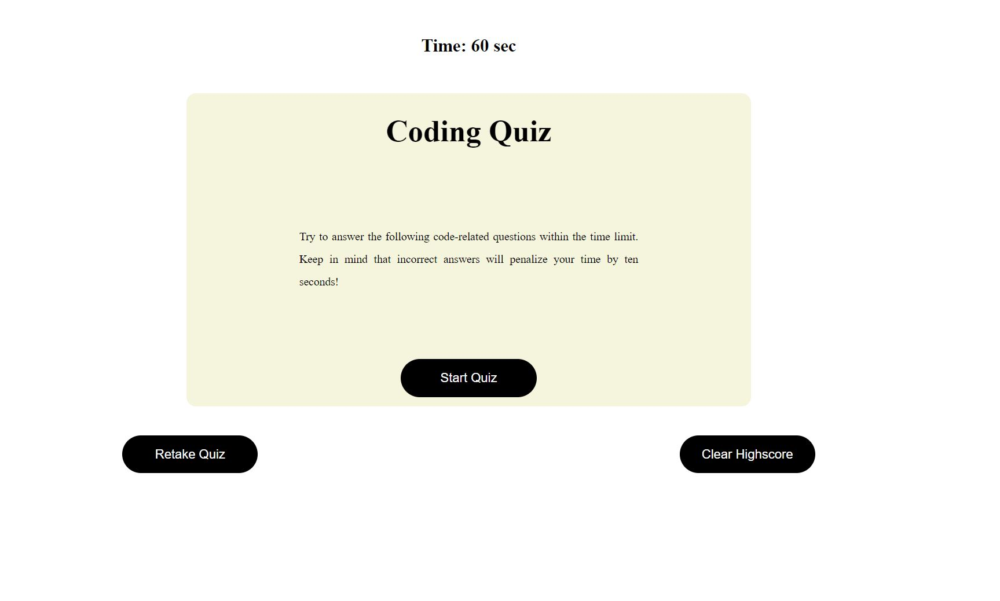
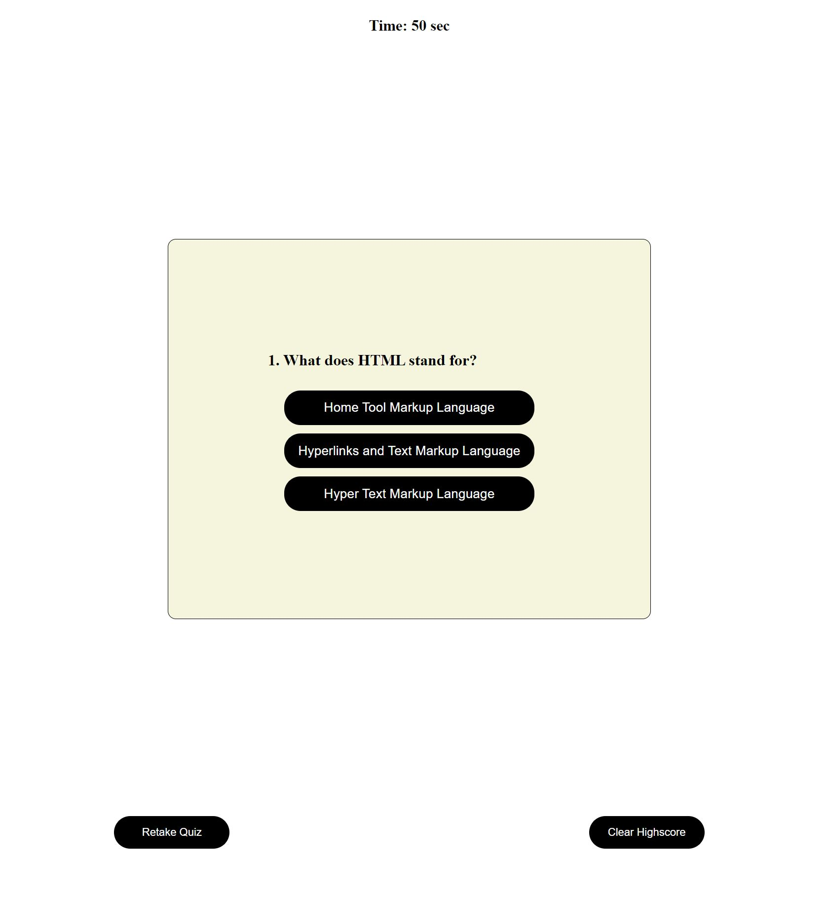
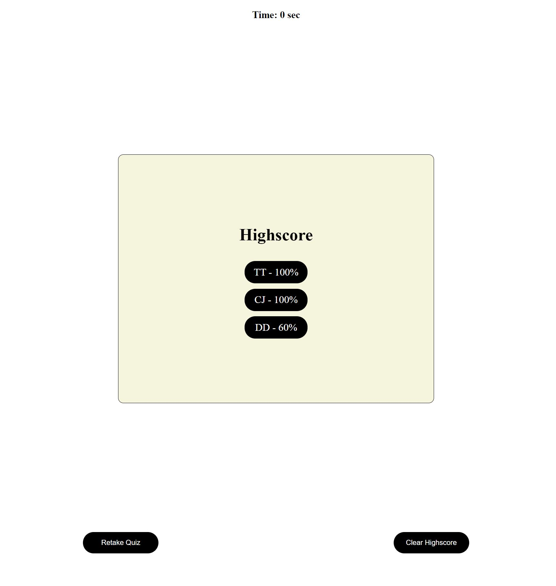

# Code Quiz
The application is intended to sharpen coding skills by testing your coding knowledge.

## Motivation
---------------------------
The motivation for this application is to keep track of your coding knowledge progress by savig and showing the past quiz score each time you take the quiz. This way you will be able to track your progress as your knowledge grows.

## Links 
----------------------------

[GitHub Pages](https://ettad.github.io/code-quiz/)

[GitHub Repo](https://github.com/ettad/code-quiz)

## Screenshots/Images
-----------------------------

